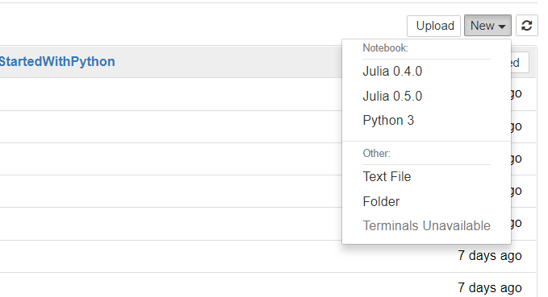
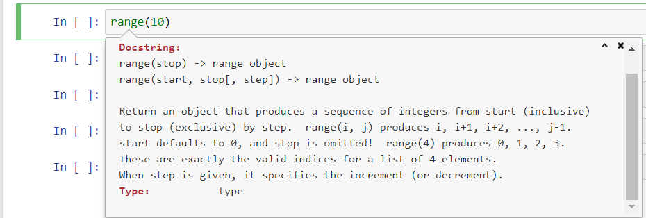

---
jupyter:
  jupytext:
    text_representation:
      extension: .md
      format_name: markdown
      format_version: '1.1'
      jupytext_version: 1.1.0-rc0
  kernelspec:
    display_name: Python 3
    language: python
    name: python3
---

```raw_mimetype="text/restructuredtext"
.. meta::
   :description: Topic: Jupyter notebooks, Difficulty: Easy, Category: Tutorial
   :keywords: jupyter, notebook, kernel, basics, server, console, command line, plot, beginner, data science
```

# Jupyter Notebooks
In recent years, the Jupyter Notebook has become a massively popular tool for doing research-oriented work in Python and other languages alike. Its emergence marked a paradigm shift in the way data science is conducted. 

A Jupyter notebook is similar to the IPython console, but, instead of only being able to work with a single line of code at a time, you can easily edit and re-execute *any* code that had been written in a notebook. Furthermore, you can save a notebook, and thus return to it later. Additionally, a notebook provides many terrific features. For instance, you can embed visualizations of data within a notebook, and write blocks of nicely-formatted text (using the [Markdown syntax](https://github.com/adam-p/markdown-here/wiki/Markdown-Cheatsheet)), for presenting and explaining the contents of the notebook. 

In this way, the Jupyter Notebook stands out as an excellent tool for many practical applications. You could work on a notebook while you are working through sections of this website, for instance, testing out snippets of code, and answering reading-comprehension questions as you proceed through the text, and using markdown-headers to visually separate different portions of the notebook. When I do research, I am always creating Jupyter notebooks in which I write code that analyzes data, I plot various results, presented in different ways, and I write detailed markdown-text blocks to document my work. The end result is something that I can share with my labmates, and easily revisit months later without having to struggle to recall what I had done.

Enough gushing about Jupyter notebooks. Let's start using them!


## Running a Notebook Server & Creating a Notebook
In your terminal, navigate to a directory (a.k.a folder) that you are okay creating files in. If you don't know how to do this, Google it!

Once you are in the desired directory, execute in your terminal (type the following, and then hit `<ENTER>`): `jupyter notebook`

You should see some text appear in your terminal:


This is a "notebook server" that is running on your machine - it basically handles all of the communication between your browser and your machine. A new window or tab should open in your web browser, which looks like a file explorer. 


You can use this to enter subdirectories and to open up any Jupyter notebooks that you have saved. *You will need to use this file explorer any time that you want to open up a Jupyter notebook, old or new.* In the top-right corner of this window, click on the dropdown menu labeled "New", and select the option `Python 3`.



A new tab will open in your browser, revealing a "Jupyter notebook" called `Untitled.ipynb` running a Python 3 kernel. Clicking `File > Rename` in the notebook will enable you to name your notebook. `.ipynb` is the file-type suffix used for Jupyter notebooks (`ipynb` stands for "IPython-notebook", which is what these notebooks were called prior to 2014). The commands that you run in this notebook are interpreted and executed by Python in the essentially same way that they would be in a IPython console. 

<div class="alert alert-warning">

**Jupyter Notebooks Do Not Use the Internet**: 

Although a Jupyter notebook opens in your browser, *everything is happening locally on your machine*. You don't need to be connected to the internet to work on a Jupyter notebook! The notebook server that you ran in your terminal is simply routing communication from your browser to your local machine. For instance, it is sending code to your CPython interpreter to be executed.
</div>


<!-- #region -->
## Notebook Cells 
Whereas a Python console only allows you to work on one line of code at a time, a notebook allows you to write code within "cells" and to execute these chunks of code cell-by-cell. In the first cell, write the lines of code:

```python
x = 3
y = 4
```
then press `<SHIFT>+<ENTER>`. This will execute all of the code within the given cell (in this instance, assigning the variables `x` and `y` with the values 3 and 4, respectively) and then creates a new cell below. In the next cell type the code:

```python
x + y
```
and hit `<SHIFT>+<ENTER>` to execute this code. The number 7 will appear beneath the cell - this, of course, is the value that is returned when `3 + 4` is evaluated: 


Notice that the notebook "knows" about its variables across its cells. This doesn't just work from top to bottom - you can define `z = 2` in the third cell, and then execute code that references `z` in the first cell. What really matters is the *order* in which the cells are executed. Notice that `In[1]` denotes that the top cell with the first input-cell executed in the notebook, and `In[2]` denotes the second cell that was executed. 

Formally, the cells within a given notebook share a common "namespace": any variable defined in a cell can be referenced or redefined in any other cell within the notebook. On the other hand, separate notebooks are completely independent from one another. You can be working on multiple notebooks at once, and they will never "know" about one another. 

A major value of using a notebook is that you can rapidly edit these cells (say, change `x = 3` to  `x = 10`), and re-execute them to nimbly tinker with whatever code you are developing. Although simple, this is a hugely powerful environment for prototyping code. 
<!-- #endregion -->

## An Example Notebook
To show off a more exciting use-case, let's create a notebook that plots some data for us. We'll use matplotlib, a Python library that is used for plotting data, and NumPy, the premiere library for doing numerical work in Python. We will import these libraries for use in our code. Next we'll define some mathematical functions. And finally, we'll plot these functions evaluated on a large number of closely-spaced points on the domain.

```python
import numpy as np
import matplotlib.pyplot as plt

# this tells Jupyter to embed matplotlib plots in the notebook
%matplotlib notebook 
```

```python
def sinc(x):
    return np.sin(x) / x

def d_sinc(x):
    "derivative of sinc-function"
    return np.cos(x)/x - np.sin(x)/x**2
```

```python
# evaluate functions at 1000 points evenly spaced in [-15, 15]
x = np.linspace(-15, 15, 1000)
f = sinc(x)
df = d_sinc(x)
```

```python
# plot the sinc-function and its derivative
fig, ax = plt.subplots()
ax.plot(x, f, color="red", label=r"$sinc(x)$")
ax.plot(x, df, color="blue", ls="--", label=r"$\frac{d(sinc(x))}{dx}$")


ax.set_title("Example Notebook Plot")
ax.set_xlabel(r"$x$ [radians]")

ax.grid(True)
ax.legend();
```

Notice that this notebook interface is great for making  adjustments to this plot. You can easily change the color or line-style of the plot and redraw it without having to recompute the functions. You simply re-execute the cell containing the plot code. This is especially nice when the numerical computations required to generate the curves are costly.


## Familiarizing Yourself with Jupyter Notebooks
Here, we will review some essential keyboard shortcuts and notebook features, which will enable you to use notebooks competently. A notebook has two modes of operation: 

**Command Mode (Press** `<ESC>` **to activate)** 

When in command mode, you can use keyboard shortcuts to create/delete/cut/paste notebook cells, and to change a cell's type between code and markdown modes. Your selected cell will be surrounded by a *blue* border when you are in command mode. For a complete listing of keyboard shortcuts, toward the top of the notebook click `Help > Keyboard Shortcuts`. The most critical shortcuts are:

- create a new cell above the current cell: `a`
- create a new cell below the current cell: `b`
- delete the current cell: `dd`
- restart the notebook kernel (kill all executions and erase all defined variables): `00`
- change the current cell's type to "Code": `y`
- change the current cell's type to "Markdown": `m`

**Edit Mode (Press** `<Enter>` **to activate)** 

Edit mode simply permits you to type text into the selected cell. When in edit mode, the current cell will be surrounded by a *green* border. There are two commands for executing a cell:

- execute current cell: `<CTRL>+<ENTER>`
- execute current cell and then create a new cell below: `<SHIFT>+<ENTER>`

By default, a cell will be a code-type cell, meaning that its content will be formatted and executed as Python code. Just as you saw when using the IPython notebook, `<TAB>` can be used to perform autocomplete. Additionally, when your cursor is on the name of a Python function in your code, `<SHIFT>+<TAB>` will bring up a small window with the function's documentations string. This is *very* useful.



### Markdown Cells
When a cell is set to Markdown type, its content will not be interpreted as Python code. Instead, its contents will be rendered as stylized text. Refer to [this page](https://github.com/adam-p/markdown-here/wiki/Markdown-Cheatsheet) as a reference for various markdown stylings. Using markdown cells allows you to create section and subsection headers for your notebook, you can [render LaTeX math equations](http://jupyter-notebook.readthedocs.io/en/stable/examples/Notebook/Working%20With%20Markdown%20Cells.html#LaTeX-equations), embed images and videos in your notebook, and much more. In fact, every page in this website was created using Jupyter notebooks! Markdown-type cells are tremendously useful for creating high-quality, well-documented Jupyter notebooks. These are perfect for lab-report assignments.

<div class="alert alert-warning">

**Be Aware of Cell-Type**:

If you ever find that your Python code isn't being formatted properly, and doesn't run at all when you execute the cell (you get no output, not even errors), there is a good chance that you have accidentally set the cell to be a 'Markdown'-type cell! Change the cell back to code-type by entering command mode (`<ESC>`) and pressing `y`.

</div>


### Using Jupyter Notebooks with Other Languages
The Jupyter Notebook does not work exclusively with Python. A "kernel" can be developed in order to provide support for a given programming language in Jupyter. Indeed, kernels for several prominent programming languages are being developed for use with Jupyter: 

- [R](https://github.com/IRkernel/IRkernel)
- [Julia](https://github.com/JuliaLang/IJulia.jl)
- [Ruby](https://github.com/SciRuby/iruby)
- [C++](https://github.com/QuantStack/xeus-cling)
- [Haskell](https://github.com/gibiansky/IHaskell)
- [Go](https://github.com/gopherdata/gophernotes)

The ever-growing list of available kernels for use with Jupyter can be found [here](https://github.com/jupyter/jupyter/wiki/Jupyter-kernels). It should be noted that these efforts are not all equally mature. For instance, whereas the Python and Julia kernels are robust, the Haskell kernel cannot run natively on Windows machines, and the C++ kernel is still in early development, as of writing this. 

